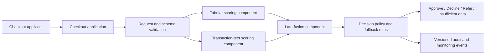
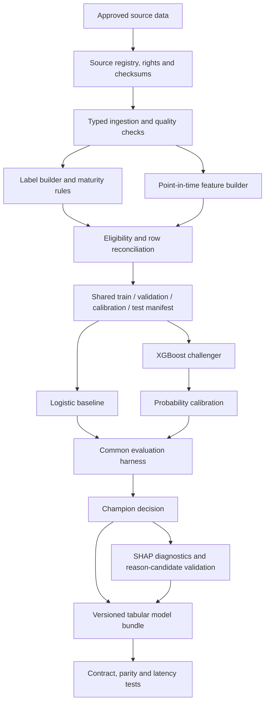
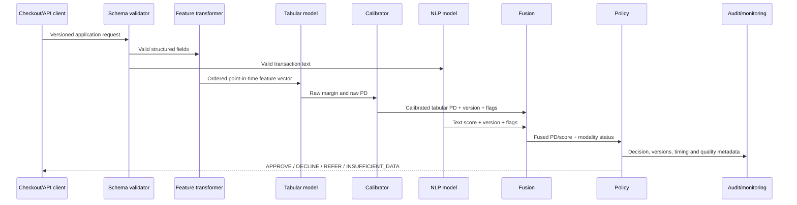

# System Architecture

**Document status:** Proposed for G0 review  
**Version:** 0.1  
**Date:** 7 September 2026  
**Owner:** Tabular Track Tech Lead  
**Reviewers:** NLP Track Lead, Fusion/API Lead and project co-leads

## 1. Purpose

This document defines the preliminary architecture and boundaries of the Instant Checkout Credit Engine. It is intentionally implementation-light during Week 1. The goal is to agree data, model and service contracts before code makes them expensive to change.

## 2. Architectural principles

1. One application-level prediction problem across all tracks.
2. Point-in-time correctness: features must have been available by the decision cut-off.
3. Labels and outcome data are isolated from inference features.
4. Model score, calibration, fusion and lending policy are separate versioned concerns.
5. Structured and text models share application IDs, labels and split manifests.
6. Base-model predictions used to train fusion are out-of-fold or held out.
7. Missing/stale data produces explicit quality or referral states.
8. The simplest adequate baseline remains eligible to win.
9. Latency is measured end to end and by component under a frozen protocol.
10. No PII, secrets or restricted data enters the public repository.

## 3. Context diagram



The user-facing response remains the responsibility of the policy/product layer. The tabular component returns risk evidence and quality flags.

## 4. Offline training architecture



### 4.1 Isolation requirements

- Label tables are accessible to training/evaluation code but not online feature code.
- The final test manifest is not used for feature selection, hyperparameter tuning or calibration.
- Audit-only protected/group attributes are stored separately from serving features.
- Raw/restricted datasets and model binaries remain outside Git unless explicitly approved.

### 4.2 Split ownership

One shared split manifest is generated after eligibility and label maturity are applied. The tabular and NLP tracks consume, rather than independently recreate, this manifest.

Proposed manifest fields:

```text
application_id
customer_id_hash
decision_timestamp
label_version
split_name
split_version
eligibility_flag
exclusion_reason
```

Time-respecting splits are preferred. Repeated customers require grouped/time-aware treatment.

## 5. Online inference architecture



### 5.1 Tabular serving pattern

The preferred prototype pattern is to send validated raw/snapshot fields to a tabular package that owns deterministic feature transformation, model scoring and calibration. This reduces offline/online skew while the feature set is still small.

If a separate feature service is later introduced, feature definitions, freshness, version and offline/online parity become explicit external contracts.

## 6. Tabular input contract

Proposed `TabularApplicationV0`:

| Field | Type | Status | Notes |
|---|---|---|---|
| `application_id` | String | Required | Immutable request ID |
| `customer_id` | Pseudonymous string | Required where available | Used for history and monitoring; never exposed publicly |
| `decision_timestamp` | Timestamp | Required | Closes the feature window |
| `schema_version` | String | Required | Reject unsupported versions |
| `requested_amount` | Decimal | Candidate | Must define currency and valid range |
| `basket_amount` | Decimal | Candidate | Known before decision |
| `term_or_installment_count` | Integer | Candidate | Product definition required |
| `down_payment_amount` | Decimal | Candidate | Missing/zero semantics required |
| `merchant_category` | String | Candidate | Unknown-category behavior required |
| `customer_snapshot` | Object | Candidate | Only decision-time available fields |
| `cashflow_snapshot` | Object | Candidate | Must include freshness/window metadata |
| `visible_obligations` | Object | Candidate | Incomplete external-liability risk remains |

The G1 data decision will determine the actual v1 fields. Candidate fields must not be treated as confirmed simply because they appear in this document.

## 7. Tabular output contract

Proposed `TabularRiskOutputV1`:

```json
{
  "application_id": "example-application",
  "model_version": "tabular-0.1.0",
  "schema_version": "tabular-input-1.0",
  "raw_margin": 0.0,
  "pd_raw": 0.0,
  "pd_calibrated": 0.0,
  "quality_flags": [],
  "reason_candidates": [],
  "processing_ms": 0.0
}
```

### Contract rules

- `pd_raw` and `pd_calibrated` are probabilities for the same versioned bad outcome.
- The fusion component must not treat a calibrated probability as an unconstrained logit.
- Feature order is stored and validated with the model artifact.
- Missing mandatory data produces a typed error or quality state, not an invented default value.
- Model, transformer, calibrator, schema and reason map are loaded as one compatible bundle.
- The same request and version produce the same output within a declared numerical tolerance.

## 8. Fusion architecture

The initial comparison must include:

1. Logistic tabular only.
2. XGBoost tabular only.
3. Text only.
4. A simple combination of calibrated scores where valid.
5. Logistic stacking over frozen tabular/text scores.
6. The proposed learned late-fusion head.

To prevent stacking leakage, fusion training receives out-of-fold or genuinely held-out predictions from the base models. In-sample base-model predictions cannot be used as training evidence for the fusion head.

## 9. Policy and fallback states

| Condition | Required behaviour |
|---|---|
| Valid tabular and text outputs | Apply frozen fusion and policy versions |
| Text unavailable, tabular quality acceptable | Use an approved tabular-only fallback or return `REFER`; record modality failure |
| Mandatory tabular data invalid/stale | Return `INSUFFICIENT_DATA` or `REFER`; do not fabricate a neutral score |
| Unsupported schema version | Reject request with clear typed error |
| Model/transformer/calibrator mismatch | Fail closed and alert |
| Explanation path too slow | Follow explicit synchronous/asynchronous design; never silently omit promised output |
| Timeout or service saturation | Apply agreed safe fallback and monitoring event |

Fallback decisions belong to the policy/API contract, not hidden inside the model.

## 10. Explainability architecture

TreeSHAP is used offline and, if latency permits, for selected local diagnostics. It supports:

- Global feature-contribution analysis.
- Dependence/interaction review.
- Error analysis.
- Candidate local reasons.
- Stability comparisons across time/refits/subgroups.

Reason candidates require a controlled feature-to-language map and tests for actual use, direction, perturbation and stability. SHAP alone does not prove causality, fairness or compliance.

## 11. Latency architecture

### Provisional SLO

- Full warmed request path: p95 <= 100 ms on agreed hardware and concurrency.
- Tabular feature transformation + model + calibration: p95 <= 10 ms, p99 <= 20 ms.
- Cold start reported separately.
- Explanation generation measured separately and then within the full path if synchronous.

### Benchmark boundary to freeze

- Hardware, operating system/container and library versions.
- Payload size and text length.
- Batch size, concurrency and worker count.
- Warm-up request count and measured request count.
- Schema validation, feature transformation, both models, fusion, policy, explanation and serialization timing.
- p50/p95/p99, throughput, memory and error rate.

Asynchronous HTTP handling does not make CPU-bound inference inherently asynchronous. Worker count and model memory must be measured together.

## 12. Model artifact and versioning

The tabular bundle must contain:

- Feature/schema version.
- Deterministic feature transformer.
- Feature order and missing-value rules.
- Trained model.
- Probability calibrator.
- Reason-code mapping.
- Model manifest with Git SHA, data/split/config hashes, seeds, dependency versions and training time.
- Canonical request/response fixtures.

Suggested version namespaces:

- `tabular-input-1.0`
- `label-bad-30dpd-90d-1.0`
- `split-1.0`
- `tabular-1.0.0`
- `fusion-1.0.0`
- `policy-1.0.0`

The policy threshold must not be embedded invisibly in the model artifact.

## 13. Data and security boundaries

- The repository is public; live PII and raw transactions are prohibited.
- Restricted datasets remain in approved controlled storage.
- Public test fixtures are synthetic and obviously marked.
- Logs use pseudonymous identifiers and avoid raw transaction text/financial fields unless explicitly required and protected.
- Secrets come from an approved runtime mechanism, never source control.
- Published subgroup results include sample sizes and suppress or warn on small groups.

## 14. Monitoring architecture

### Immediate signals

- Request volume and schema failures.
- Missingness, staleness and unknown categories.
- Feature range violations.
- Score/decision distributions.
- Component and full-path p50/p95/p99 latency.
- Timeouts, fallbacks and version mismatches.

### Delayed-label signals

- Bad rate by score band/cohort.
- Ranking metrics with event counts.
- Brier score and calibration slope/intercept.
- Approval/bad-rate and expected-loss curves.
- Supported subgroup performance.

### Rollback unit

Rollback restores model, transformer, calibrator, schema, reason map and policy compatibility together. A rollback drill is required before final release.

## 15. Component ownership

| Component/artifact | Responsible | Accountable |
|---|---|---|
| Problem/label specification | Tabular analyst | Tabular lead |
| Structured feature pipeline | Tabular analyst | Tabular lead |
| Logistic/XGBoost models | Tabular analyst | Tabular lead |
| Calibration and tabular reasons | Tabular analyst | Tabular lead |
| Text pipeline/model | NLP analyst | NLP lead |
| Shared split manifest | Named data owner, jointly reviewed | Tabular/NLP leads |
| Late fusion | Fusion engineer/analyst | Fusion lead |
| API/container/full SLO | API engineer | Fusion/API lead |
| Final policy and claims | Track leads consulted | Project co-leads |
| Independent validation | Non-author reviewer | Tabular lead |

## 16. Week 1 architecture decisions required

- Confirm prediction unit and primary label.
- Confirm which service owns feature transformation.
- Confirm shared manifest owner and format.
- Confirm fusion score inputs.
- Confirm missing-modality fallback.
- Confirm latency boundary and target hardware assumption.
- Confirm how explanations appear in the synchronous response.

Unresolved decisions must be recorded in the decision log with owners and deadlines.
