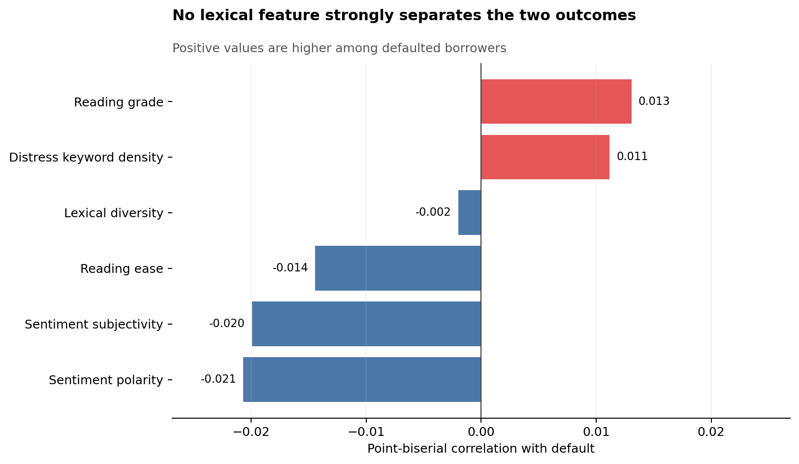
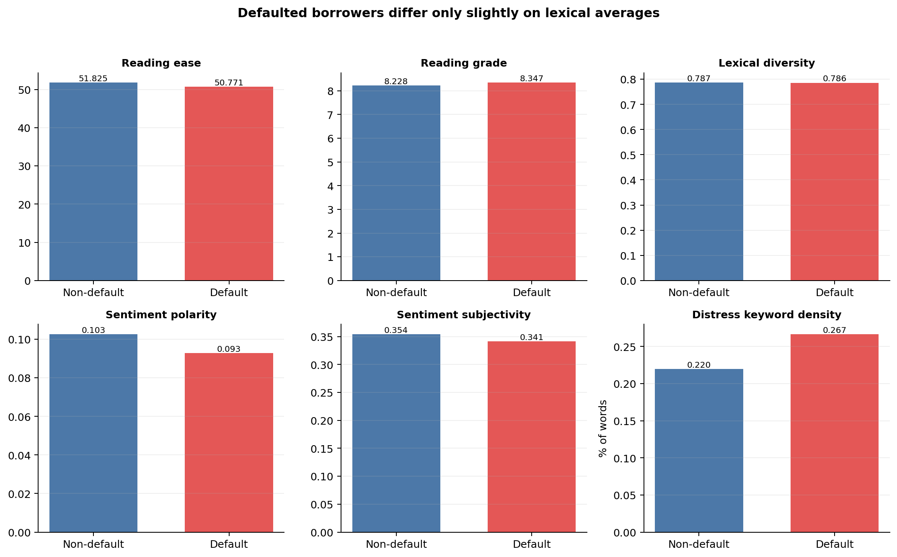
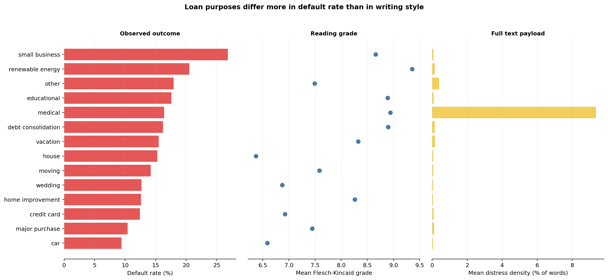
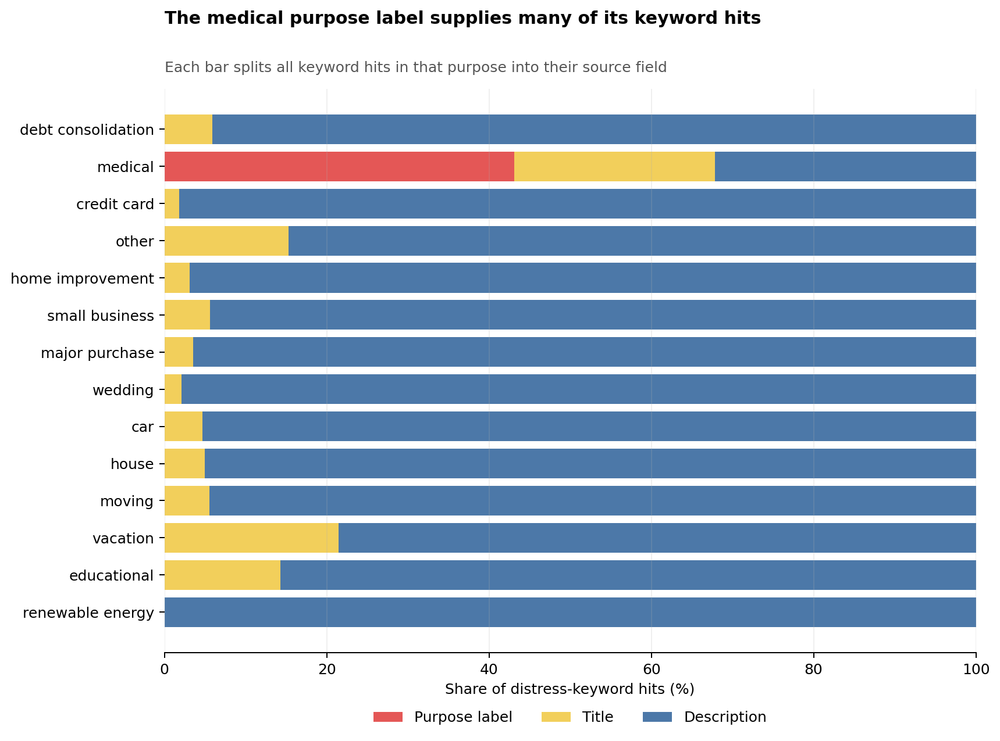

# NLP Lexical Feature Correlation and EDA

**Analysis version:** `nlp-lexical-eda-v1`<br>
**Dataset version:** `kaggle-adarshsng-local-2026-09-09`<br>
**Split:** frozen training split only (`86,293` rows; `13,197` defaults)<br>
**Test/validation outcomes used:** no

## Headline finding

The honest answer is that none of these features separates the two borrower outcomes well.
`sentiment_polarity` ranks first, but its point-biserial correlation is only
`r = -0.0207`. Reading grade (`r = 0.0131`) is only slightly
stronger than distress-keyword density (`r = 0.0112`). These are small shifts in group
averages, not useful standalone rules for predicting default.



## Point-biserial correlations

Positive `r` means the feature is higher among defaulted borrowers. The full-precision table,
including p-values, is `reports/nlp/lexical_feature_correlations.csv`.

| Feature | r | Non-default mean | Default mean | Difference |
|---|---:|---:|---:|---:|
| sentiment_polarity | -0.0207 | 0.1026 | 0.0928 | -0.0099 |
| sentiment_subjectivity | -0.0199 | 0.3544 | 0.3414 | -0.0130 |
| flesch_reading_ease | -0.0144 | 51.8251 | 50.7706 | -1.0545 |
| flesch_kincaid_grade | 0.0131 | 8.2277 | 8.3467 | 0.1191 |
| financial_distress_keyword_density | 0.0112 | 0.0022 | 0.0027 | 0.0005 |
| lexical_diversity_ttr | -0.0020 | 0.7867 | 0.7861 | -0.0006 |

Detailed count, standard deviation, quartile and range statistics for both outcomes are in
`reports/nlp/lexical_feature_outcome_summary.csv`.



## Purpose-level aggregation

| Purpose | Loans | Mean reading ease | Mean reading grade | Mean distress density | Default rate | Desc distress mention rate | Purpose-label-only hit rate |
|---|---:|---:|---:|---:|---:|---:|---:|
| car | 1,699 | 62.74 | 6.59 | 0.00043 | 0.0942 | 0.0212 | 0.0000 |
| credit_card | 16,029 | 61.19 | 6.93 | 0.00084 | 0.1243 | 0.0400 | 0.0000 |
| debt_consolidation | 48,439 | 47.00 | 8.90 | 0.00145 | 0.1619 | 0.0537 | 0.0000 |
| educational | 290 | 51.61 | 8.89 | 0.00089 | 0.1759 | 0.0517 | 0.0000 |
| home_improvement | 5,432 | 50.68 | 8.26 | 0.00052 | 0.1261 | 0.0258 | 0.0000 |
| house | 720 | 65.30 | 6.37 | 0.00066 | 0.1528 | 0.0375 | 0.0000 |
| major_purchase | 2,659 | 57.11 | 7.44 | 0.00115 | 0.1042 | 0.0361 | 0.0000 |
| medical | 849 | 46.04 | 8.94 | 0.09357 | 0.1637 | 0.5618 | 0.4382 |
| moving | 677 | 58.21 | 7.58 | 0.00060 | 0.1418 | 0.0310 | 0.0000 |
| other | 5,313 | 56.22 | 7.49 | 0.00403 | 0.1794 | 0.0866 | 0.0000 |
| renewable_energy | 117 | 44.28 | 9.36 | 0.00145 | 0.2051 | 0.0427 | 0.0000 |
| small_business | 2,405 | 51.82 | 8.66 | 0.00079 | 0.2682 | 0.0366 | 0.0000 |
| vacation | 471 | 49.44 | 8.33 | 0.00164 | 0.1550 | 0.0382 | 0.0000 |
| wedding | 1,193 | 62.52 | 6.87 | 0.00045 | 0.1266 | 0.0285 | 0.0000 |

The contrast between `small_business` and `debt_consolidation` is a useful example.
`small_business` has a 26.8% empirical default
rate and a mean grade of 8.66. For
`debt_consolidation`, the corresponding figures are
16.2% and
8.90. Writing complexity is similar, while the
observed default rates are far apart. The purpose field is likely carrying differences in the
loans and borrowers that this simple table does not control for.

`small_business` has the highest purpose-level default rate at
26.8%. Treat that as a description of this
training sample, not as an estimate of what the purpose itself causes.



## Is distress density a category-label artifact?

Yes, in one important case. Across training rows,
11.6% of all distress-keyword hits in the
full payload come directly from the `purpose` field. The only purpose label that contains one of
the configured distress words is `medical`.
For `medical`, 43.8% of rows have a purpose-label hit with no distress keyword in `desc`; only 56.2% of descriptions contain a distress keyword.

The full-payload density therefore mixes two ideas: what the borrower wrote and which category
the loan belongs to. For questions about borrower prose, use the description-only density and
mention-rate columns in `reports/nlp/lexical_purpose_summary.csv`. Title hits remain part of the
full payload, but the source chart keeps them separate from both purpose and description.



## Method and limitations

- Point-biserial correlations are computed against the binary target on training rows only.
- Reading grade is `flesch_kincaid_grade`; distress density uses the fixed keyword set in
  `src/nlp/features_lexical.py`.
- Source-field keyword counts are recomputed and checked against the tracked full-payload density.
- P-values are included in the CSV. With more than 86,000 rows, a small p-value can accompany a
  correlation that has little practical value, so the effect size matters more here.
- LendingClub is an evidence-lane proxy, not a representative Singapore BNPL population.
- No multiple-testing correction, causal claim, or model-selection decision is made here.

## Reproduction

From the repository root, with the approved `data/raw/loan.csv` present:

```text
python -m src.nlp.lexical_eda
```
